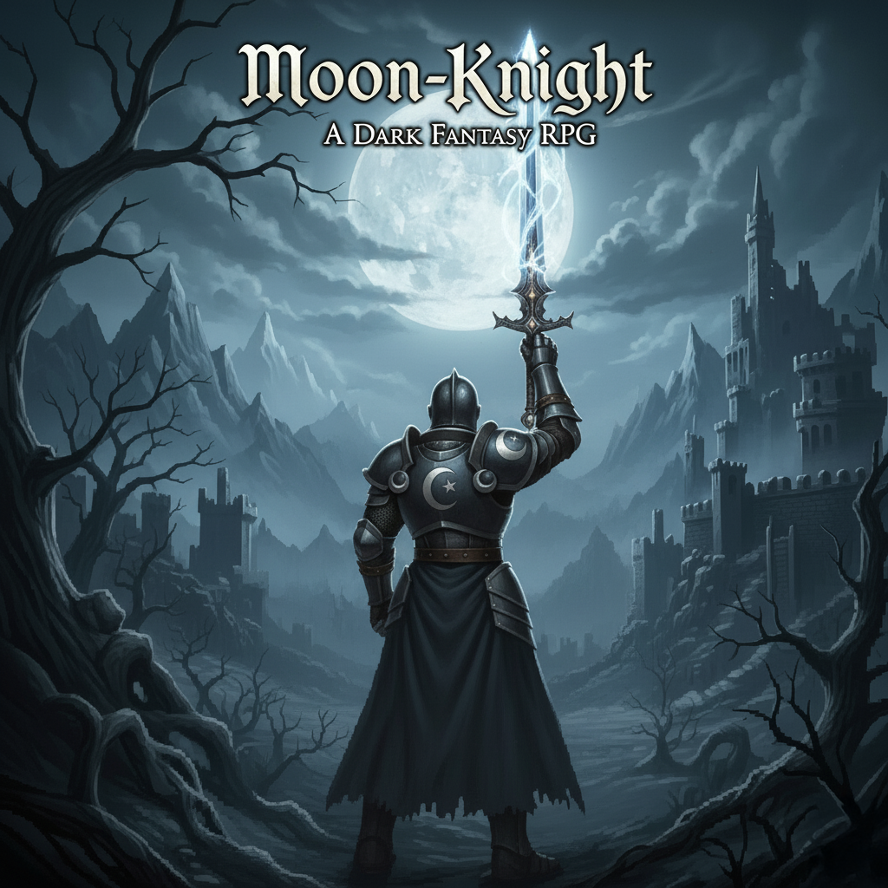
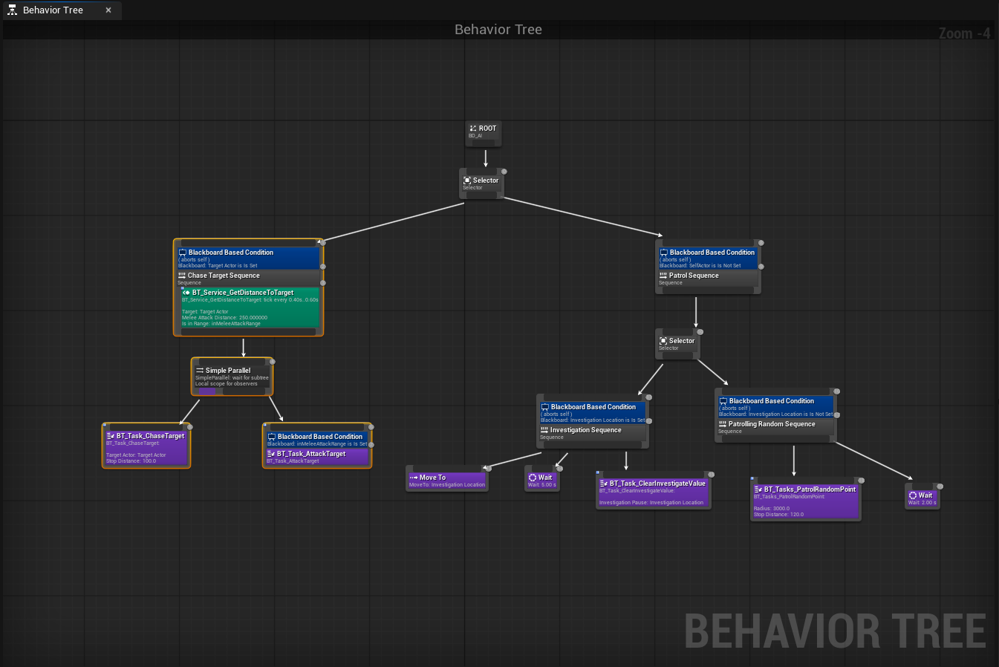
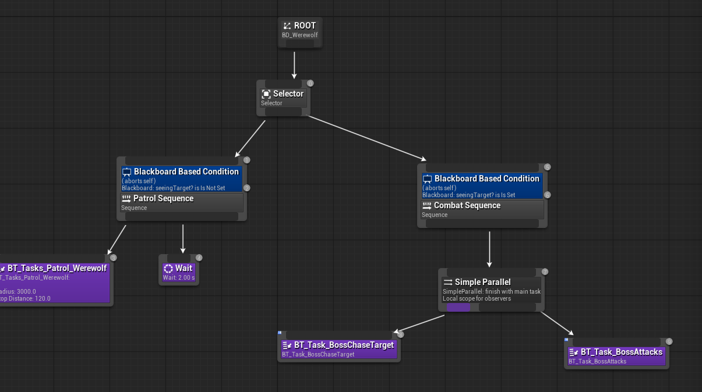
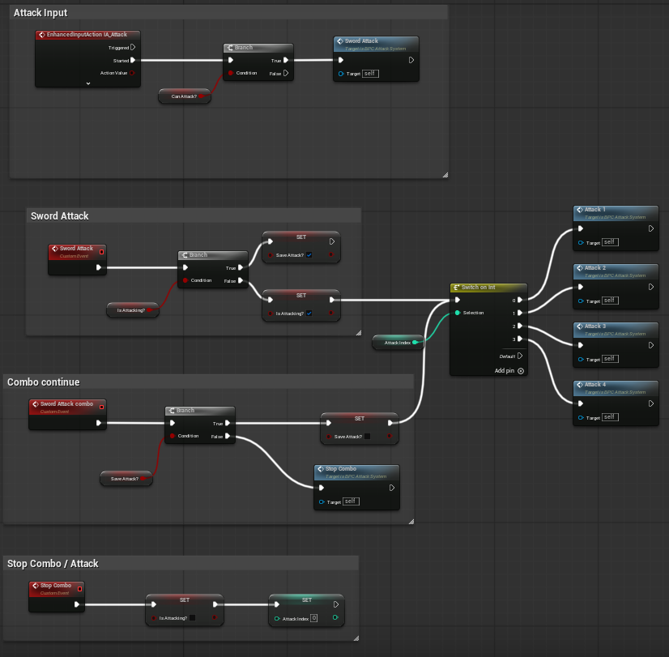
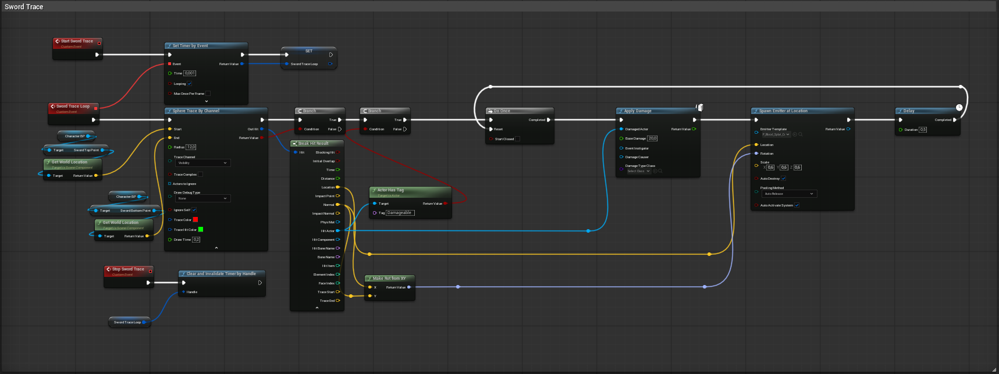
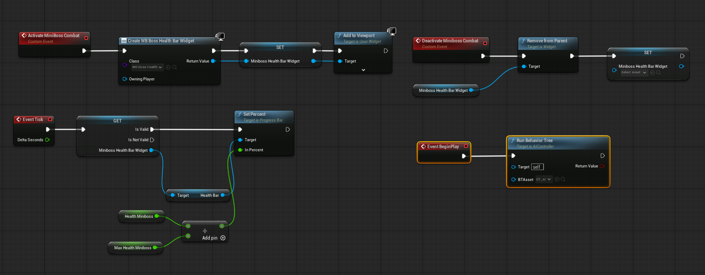
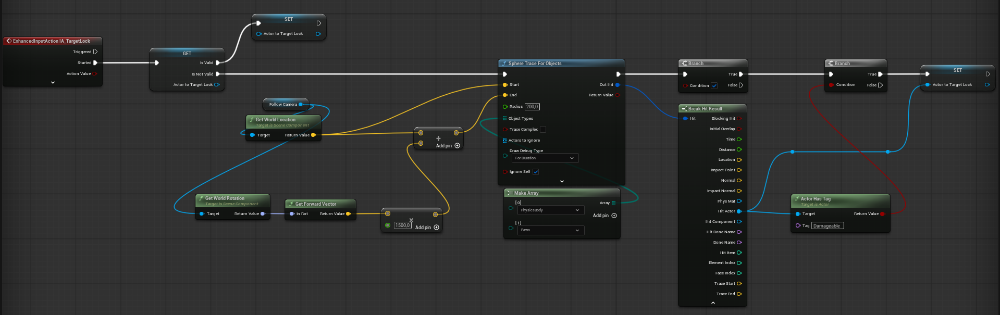

# Moon Knight — UE5 Action RPG
 


 
A solo-developed third-person action RPG built in Unreal Engine 5. All core gameplay systems — combat, enemy AI, animation, inventory, equip, dialogue, target lock, and death — were designed and implemented from scratch using Blueprint Visual Scripting.
 
---
 
## 🎬 Gameplay Preview

[]([https://www.youtube.com/watch?v=YOUR_VIDEO_ID](https://youtu.be/MnGfEbrWqQs))

---

## ⚔️ Systems Overview
 
### Combat System
 
The player attacks using a **4-hit light attack combo chain** driven by an `AttackIndex` integer (0–4) routed through a `Switch on Int` node. Each attack plays its own Animation Montage and sets the index to the next value. After the 4th hit the combo finisher triggers automatically.
 
- **Combo continuation** is managed via a `SaveAttack` boolean — if the player inputs during an active attack, the next attack is queued and fires on the combo window
- **Combo reset** sets `IsAttacking` to false and `AttackIndex` back to 0
- **Player can be hit mid-combo** — no invincibility frames during attacks
- **Player can dodge mid-combo** at any point in the chain
 
**Hit detection** uses a looping `Sphere Trace By Channel` (Visibility) running every **0.001s** between `SwordTopPoint` and `SwordBottomPoint` bones on the weapon mesh. Valid targets are filtered by the Actor Tag `"Damageable"`. On a confirmed hit, `ApplyDamage` is called and a particle emitter spawns at the impact location.
 
| | Player | Enemy |
|---|---|---|
| Sphere trace radius | 120 units | 300 units |
| Base damage | 200 | 140 |
| Trace channel | Visibility | Visibility |

---

### Enemy AI — Standard Enemy
 
Driven by a custom **Behaviour Tree** (`BD_AI`) with four states managed via Blackboard keys:
 
```
Patrol → Investigate (on sound) → Chase → Attack
```
 
- **Patrol** — moves to random points within a **3000 unit** radius, waits **2 seconds** at each point
- **Investigate** — on detecting the player via hearing, moves to the last known location and waits **9 seconds** before resuming patrol
- **Chase** — `BT_Task_ChaseTarget` moves toward `TargetActor`, stops at **100 units**
- **Attack** — triggers when within **250 units** of the target via `BT_Task_AttackTarget`
 
A `BT_Service_GetDistanceToTarget` service ticks every **0.40–0.60 seconds** to update the `inMeleeAttackRange` Blackboard key, gating the transition from chase to attack.
 
Detection is handled by a dedicated AI Detection Blueprint using UE5's **Perception System** (sight stimulus). On detection, the target actor is written to the Blackboard. On losing sight, the Blackboard key is cleared.

---

### Enemy AI — Mini-Boss (Werewolf)
 
A distinct enemy type with a simpler but more aggressive Behaviour Tree (`BD_Werewolf`):
 
```
Patrol ↔ Combat (Chase + Attack simultaneously)
```
 
- No investigation state — once the player is spotted (`seeingTarget? Is Set`), the boss immediately enters combat
- Uses a `Simple Parallel` node to **chase and attack at the same time**, unlike the standard enemy which does one or the other
- Has a **dedicated health bar widget** (`WB_Werewolf_H`) that appears on aggro and tracks `Health / 350.0` via `SetPercent` on Event Tick
- `BT_Task_BossChaseTarget` and `BT_Task_BossAttacks` are custom tasks separate from the standard enemy's
 
| | Standard Enemy | Mini-Boss |
|---|---|---|
| Max health | 200 | 350 |
| Investigation | Yes (9s) | No |
| Chase + Attack | Sequential | Simultaneous (Simple Parallel) |
| Health bar | Shared HUD | Dedicated widget |

---

### Target Lock System
 
Triggered by `IA_TargetLock` input. Fires a **Sphere Trace For Objects** (**radius 200, range 1500 units**) from the camera forward vector, filtering for `PhysicsBody` and `Pawn` object types. The hit actor is validated against the `"Damageable"` tag before being stored as the lock target. Triggering again when a target is already locked clears the reference (toggle).

---

### Inventory & Equip System
 
Slot-based inventory backed by a **Data Table** using custom `S_Slots` and `S_Items` structs. Each item row stores: Name, Damage, Icon, StaticMesh, Type, and WeaponSocket.
 
Equipping a weapon calls `Get Data Table Row` → `Break S_Items` → `Set Static Mesh` on the appropriate character socket. Supports two equip slots: **Sword** and **Bow**.

---

### Pickup System
 
On `IA_Interact` input, a **Sphere Trace For Objects** (radius **7 units**, range **1000 units**) fires from the camera forward vector into `WorldDynamic` objects. On hit, the actor is cast to `BP_Weapon`, added to inventory via `AddWeapon`, and destroyed from the world.

---

### Death & Respawn
 
On the `Die` event:
1. Player input is disabled
2. Mesh physics simulation is enabled (ragdoll)
3. Camera fades from **0 → 1** over **5 seconds**
4. After a **4.9 second** delay, the current level is reloaded via `Open Level (by Name)`

---

### HUD / UI
 
| Element | Description |
|---|---|
| Player health bar | Driven by `CurrentHealth / MaxHealth` via `SetPercent` |
| Enemy health bar | Shared across standard enemies and player via character type selector |
| Mini-Boss health bar | Dedicated widget (`WB_Werewolf_H`), activated on aggro |
| Inventory screen | Slot-based UMG widget |
| Dialogue box | Linear NPC conversations with speaker name display |

---

## 🏗️ Architecture
 
```
Player Controller (BP_ThirdPersonCharacter)
│
├── BPC_Attack System     — combo state machine, sword trace, ApplyDamage
├── BPC_Equipment System  — data table equip, weapon socket swap
├── IA_Interact           — pickup sphere trace (r=7, range=1000)
├── IA_TargetLock         — lock-on sphere trace (r=200, range=1500)
└── HUD Widget            — health bar, stamina bar, level text
 
Standard Enemy (BP_AI)
│
├── Behaviour Tree (BD_AI)
│   ├── Patrol        — random point (r=3000), wait 2s
│   ├── Investigate   — move to sound location, wait 9s
│   ├── Chase         — BT_Task_ChaseTarget, stop at 100 units
│   └── Attack        — BT_Task_AttackTarget at 250 units
└── AI Detection BP   — Perception System (sight), writes to Blackboard
 
Mini-Boss (BD_Werewolf)
│
├── Behaviour Tree (BD_Werewolf)
│   ├── Patrol        — BT_Tasks_Patrol_Werewolf
│   └── Combat        — Simple Parallel: Chase + Attack simultaneously
└── WB_Werewolf_H     — dedicated health bar widget (max 350)
```

---

## 🗂️ Repository Structure
 
```
moon-knight-ue5-rpg/
├── MoonKnightRPG.h    # C++ systems architecture — all values from Blueprint implementation
└── README.md
```
 
> The full UE5 project (Blueprints, assets, maps) is not hosted on GitHub due to binary file size constraints. This repository documents the systems architecture and all tuning values extracted directly from the Blueprint implementation.

---

## 🛠️ Tech Stack
 
| | |
|---|---|
| Engine | Unreal Engine 5 |
| Scripting | Blueprint Visual Scripting |
| Architecture reference | C++ (structs, enums, constants — all values from Blueprint) |
| UI | UMG (Unreal Motion Graphics) |
| AI | Behaviour Trees + UE5 Perception System |
| Input | Enhanced Input System (IA_Attack, IA_Interact, IA_TargetLock) |
| Animation | Animation Montages, Animation Notify system |

---

## 📸 Blueprint Highlights
 
### Behaviour Tree — Standard Enemy

 
### Behaviour Tree — Mini-Boss (Werewolf)

 
### Combat System — Combo Chain

 
### Sword Trace — Hit Detection

 
### Mini-Boss Combat Activation

 
### Target Lock System

